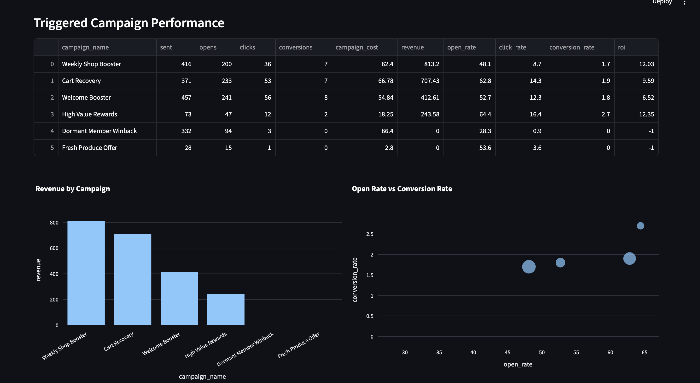
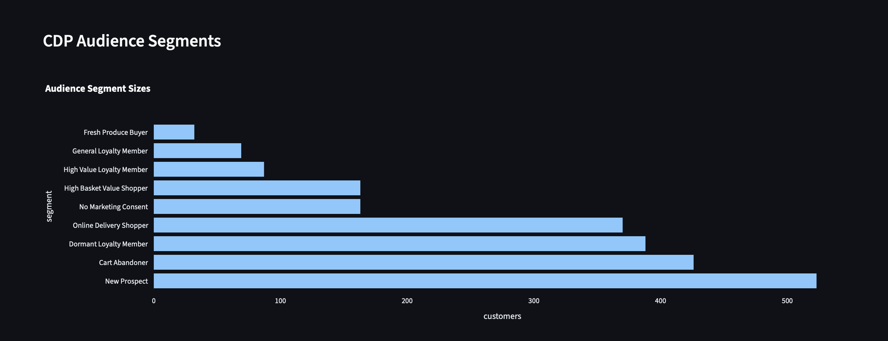
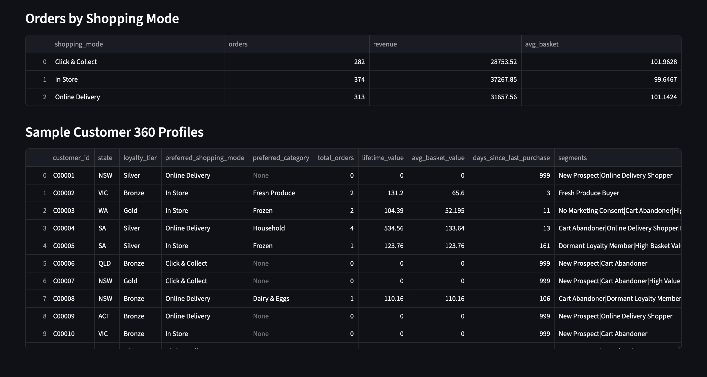

# Australian Grocery Loyalty CDP 

This project is a synthetic Australian grocery loyalty Customer Data Platform (CDP) simulation.

It shows how a retail company can collect customer events, build customer profiles, create marketing segments, trigger campaigns, and measure campaign performance.

No real customer data is used. All data is generated for learning and portfolio purposes.

## Business Problem

Grocery retailers collect many customer interactions across websites, apps, stores, loyalty cards, and email campaigns.

Marketing teams need to answer:

* Who are our best customers?
* Which customers are likely to stop shopping?
* Who abandoned their cart?
* Which campaign generated the most revenue?
* Which customer segment should receive which offer?

This project solves that by creating a small CDP-style system.

## What This Project Does

1. Generates synthetic Australian grocery customer data.
2. Creates customer events such as product views, cart additions, purchases, email opens, and email clicks.
3. Builds Customer 360 profiles.
4. Creates customer segments such as VIP customers, dormant members, and cart abandoners.
5. Simulates triggered marketing campaigns.
6. Measures campaign results such as open rate, click rate, conversion rate, revenue, and ROI.
7. Displays insights in a Streamlit dashboard.

## Martech Concepts Used

* Customer Data Platform
* Event tracking
* Customer 360 profiles
* Audience segmentation
* Loyalty marketing
* Campaign automation
* Email performance analytics
* Marketing ROI

## Tech Stack

* Python
* pandas
* NumPy
* Streamlit
* Plotly
* CSV data exports

## How to Run

Create a virtual environment:

```bash
python -m venv venv
source venv/bin/activate
```

Install dependencies:

```bash
pip install -r requirements.txt
```

Run the data pipeline:

```bash
python -m src.main
```

Launch dashboard:

```bash
streamlit run streamlit_app.py
```

## Output Files

The project generates CSV files for:

* customers
* events
* customer profiles
* segments
* campaigns
* campaign results

### Interface




## Why This Project Matters

This project demonstrates how data engineering and marketing logic work together in real Martech systems.

It is inspired by Australian grocery loyalty programs and shows how customer data can be transformed into personalised campaigns and business insights.


